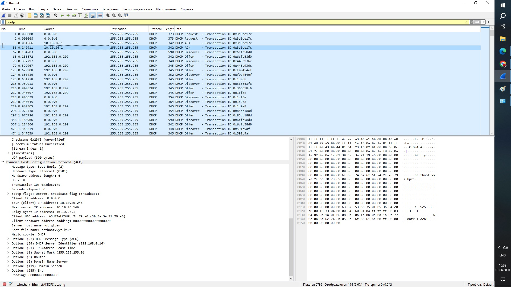
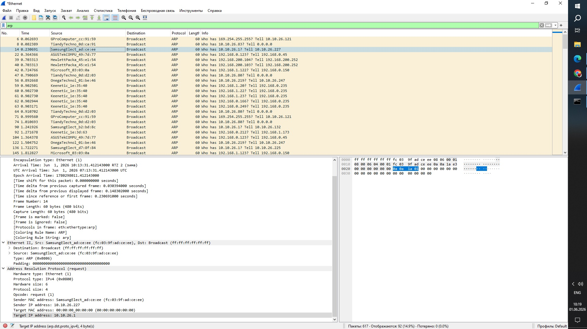

# Задание 1.
На основном интерфейсе вашего ПК (или виртуальной машины) посмотрите дамп трафика через tshark или Wireshark.

Приведите скриншоты, где показаны основные моменты работы протокола ARP и все этапы работы DHCP-протокола.

# Задание 2.
Как настраивается для сетевого пакета размер MTU в сетях, использующих только протокол IPv6?

Приведите ответ в свободной форме.

Основные принципы настройки MTU для IPv6

Минимальный размер MTU для IPv6 — 1280 байт. Все каналы IPv6 должны поддерживать это значение как минимум.

Динамическое определение MTU. 

хост отправляет пакеты с текущим MTU; \
если маршрутизатор на пути имеет меньший MTU, он отбрасывает пакет и отправляет ICMPv6-сообщение типа «Packet Too Big» обратно источнику; \
в сообщении указывается MTU следующего транзитного участка; \
хост уменьшает свой path MTU и повторно отправляет пакеты; \
процесс повторяется, пока пакеты не пройдут весь путь.

Способы настройки могут различаться в зависимости от сетевого оборудования (роутеров, коммутаторов и т. д.). Например, в некоторых устройствах можно задать MTU для интерфейса в конфигурации. Обычно это делается в режиме настройки интерфейса, где активируется IPv6 и задаётся значение MTU.

# Задание 3. 

Лабораторная работа "Построение сети и разбор передаваемых в ней пакетов"\
В Cisco Packet Tracer соберите сеть состоящую из двух маршрутизаторов (R1 и R2), за каждым из которых есть коммутатор (Switch1 и Switch2), а за коммутатором по два компьютера (Comp1, Comp2 и Comp3, Comp4). Все устройства этой сети должны быть доступны между собой.\
Сетевые настройки можно использовать следующие:
\
R1 10.1.1.1/27\
R2 10.1.2.1/27\
Приведите скриншоты таблицы коммутации и таблицы маршрутизации устройств R1, R2, Switch1, Switch2. Пришлите pkt файл.

Как будут выглядеть заголовки пакета на каждом из узловых точек сети из первой части лабораторного задания при обмене данными Comp1 с Comp4?\
Приведите ответ в свободной форме.

Каждый маршрутизатор анализирует IP-заголовок, определяет следующий узел маршрута и может обновлять некоторые поля (например, TTL, который уменьшается на единицу при каждом прохождении через маршрутизатор).
